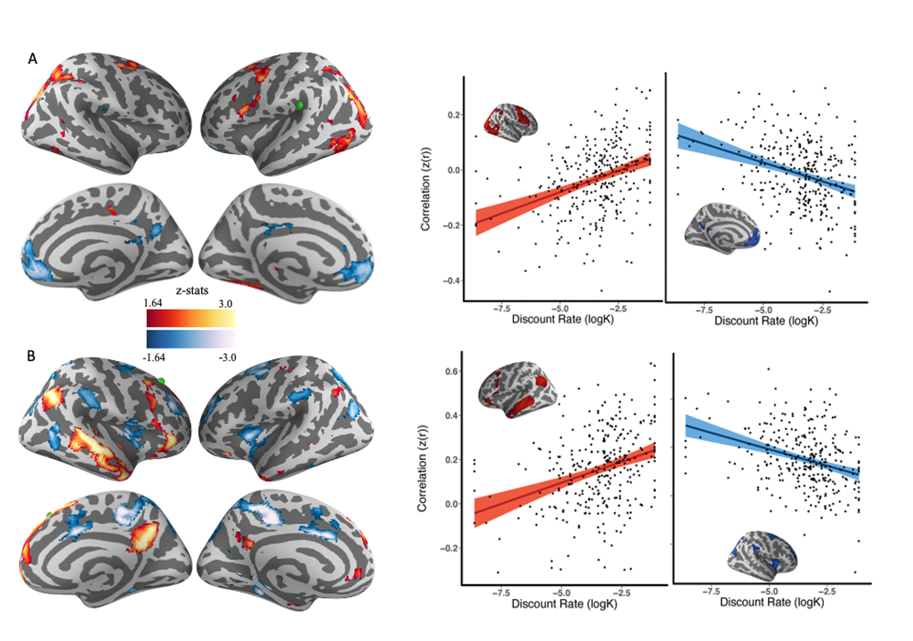

# *Connetome Wide Study of Intrinsic Functional Connectivity Associated with Impulsive Choice in Adolescence*

## Project Abstract
### Background: 
Impulsive risk-taking behavior is a major source of morbidity and mortality in adolescence and is frequently associated with psychopathology that emerges during that period. However, individual differences in functional networks that underlie impulsive choice in adolescence remain poorly understood. 

### Method: 
In this study, we investigated how complex, multivariate patterns of functional connectivity were associated with delay discounting (DD), a task that measures impulsive choice by comparing preferences for diminished immediate rewards over delayed but more substantial rewards. In a sample of 307 adolescent humans (ages 9-23 years; M =17.21 years, SD = 3.08 years; 163 females) who completed imaging as part of the Philadelphia Neurodevelopmental Cohort, we conducted a connectome-wide analysis (CWAS).  fMRI data were acquired at 3T, and processed using the eXtensible Connectivity Pipelines.   CWAS used multivariate distance-based matrix regression to examine associations between DD and multivariate patterns of connectivity at each voxel; multiple comparisons were controlled using cluster correction (z>3.09, corrected p<0.05).
		
### Results 
Two regions were identified as important drivers of functional connectivity patterns underlying individual differences in DD: the right temporal parietal junction (TPJ) and the left middle frontal gyrus (MFG). For the TPJ, greater DD was associated with greater connectivity with the dorsal attention network (DAN) and reduced connectivity with the default mode network (DMN). In contrast, for the MFG, greater DD was associated with greater functional connectivity with the DMN and reduced connectivity with the DAN. 

### Conclusion
Results of high-resolution CWAS in a large sample of youth suggest that impulsive choice in adolescence is associated with individual differences in the relationships between the DMN and the dorsal attention network. 


### Project Lead
Azeez Adebimpe

### Faculty Lead
Theodore D. Satterthwaite

### Analytic Replicator
Adam Pines

### Collaborators
Azeez Adebimpe, Adam Pines,Bart Larsen,  Mathew Cieslak, Danielle S. Bassett, Dan Romer, David R. Roalf, Raquel E. Gur,  Ruben C. Gur, Daniel H. Wolf,  Joseph W. Kable


### Project Start Date
July 2018

### Current Project Status
Drafted Manuscript as at February 2021 

### Datasets
PNC Datasets

### Github Repository
[PNC ITC](https://github.com/PennLINC/pncItcNetworks)

### Conference Presentation
- Oral presentation at the Society of Biological Psychiatry, April-May 20121. *Connectome Wide Study of Intrinsic Functional Connectivity Associated With Impulsive Choice in Adolescence.* 

## Preprocessing and computaion steps
### 1. Subject filtering. 
The subjects  were selected from [ Marieta work on apllication of NMF to T1w images ](https://github.com/PennBBL/pehlivanovaPncItcScripts). A total *452  subjects* were used for her final analyses.  Those subjects were screened further for this project. This project only used *resting-state data*.  

Criteria used for futher screened are: 
1. restExcludeVoxelwise  
2. restRelMeanRMSMotionExclude
3. resting-state data points are equal for all subjects
 
 
A total of *307 subjects* were found to passed all the criteria.

The [R script here](scripts/subjecfiltering.R) used for subject filtering. 

### 2. Downsampling resting-state data
307 subjects resting-state data were picked from data freeze that passed the screening. 
 
The data were downsampled to from 2mm to 4mm as done in previous studies for improved computational efficiency of `CWASMDMR`.  
 
This [script](scripts/downsampleniftito4mm.sh) was used to get the data into 4mm  and prepared the input data (*subjectData/imageinput_rest.csv*) list for *cwasmdmr* computation.

### 3. CWASMDMR
The computation of  CWASMDMR was  computed  with  the singularity image [cwasmdmr.simg](https://github.com/PennLINC/cwasmdmr)
Distance matrix was first computed with this script: `scripts/cwas_pearson.sh`.
The  distance matrix  was used for MDMR computation with `logk` as the main factor.Other covariates used are `sex`, `age`, and `relative rms`:

 ```math  
 distancematrix = f(logk)+relMeanRMSmotion+sex+age 
 ```

The script used for mdmr computaion: `scripts/logk_motion_sex_age.sh`

### 4. Significant clusters from mdmr
The cluster analysis was computed  with the [script](scripts/grf_fslcluster.sh), written based on  [FSL cluster analysis](https://fsl.fmrib.ox.ac.uk/fsl/fslwiki/Cluster) with  Gaussian Random Field (GRF) theory. 

The [cluster script](scripts/clusterz3.0.9.sh) was computed on the z-value obtained from mdmr  with the threshold `z=3.09`. Two clusters was obtained: one at the at the frontal region the order at the TPJ. 


### 5. Seed-based correlation 
The two  masks were upsample from 4mm to 2mm and were used as seeds for seed-based correlation.

The seed-based correlation was computed with the `scripts/seedcorrelations.sh`


### 6 Linear regression of seed correlation maps with logk

Flameo regression computation requires `design`,`contrast` and `group` as higlighed in this[script](scripts/makeflameodesig.R)

The flameo linear regression was [computed](scripts/flameo.sh) and the `zstats`  were [FDR corrected](scripts/flameoutputfdrcorrection.sh). 

The positive and negative zvalues of seed-based correlation regression with logk were [extracted](scripts/extractsignificantcluster.R) for both seed masks  and plotted as function of `logk` 



